# Instructions d'installation

La procédure suivante explique comment installer le projet dans l'environnement de développement CLion par IntelliJ sur un appareil Windows 11.

## Prérequis

- Être sur un système d'exploitation Windows 11
- Vous devez avoir télécharger l'utilitaire git.
- Avoir téléchargé CLion par IntelliJ
- Avoir installé une des versions stables de Godot: https://godotengine.org/download/windows/
- Avoir créé un premier projet dans Godot, idéalement vide

Vous devez également installer les outils suivants:

1. Un compilateur C++. La documentation officielle de Godot recommande d'installer Visual Studio Community, puis la version Visual Studio 2022 est fortement recommandée. Vous devez vous assurer que lors de l'installation, C++ fait parti des installations. Si vous avez déjà installé Visual Studio sans le support pour C++, vous pouvez tout simplement relancer l'installateur, puis une option ```Modifier``` devrait être disponible. Vous pourrez ainsi aller l'ajouter.

2. [Python 3.8+](https://www.python.org/downloads/windows/). Vous devrez ajouter votre installation de python à votre PATH.\
Voir [la procédure pour ajouter python à votre PATH](#comment-ajouter-python-au-path)

3. [SCons 4.0+](https://scons.org/pages/download.html). Veuillez installer la version la plus récente.

4. Dépendances pour Direct3D 12.\
Si votre installation de python a bien fonctionné, vous devriez pouvoir faire la commande suivante à la racine du projet pour l'installer: ```python misc/scripts/install_d3d12_sdk_windows.py```

Avec ces outils, vous serez prêt à effectuer une première compilation de votre projet.

## 1 - Télécharger le projet godot

Vous devez vous diriger sur le dépôt GitHub du projet:
https://github.com/zacharyhevey-cloud/godot

1. Cliquez sur le bouton vert ```<> Code ∨```

2. S'assurer d'être dans la section HTTPS

3. Cliquez sur le bouton copier au presse papier

4. Ensuite, dans un terminal, vous diriger dans le dossier dans lequel vous voulez le télécharger, puis entrer la commande suivante: ```git clone https://github.com/zacharyhevey-cloud/godot.git```

## 2 - Installation de l'environnement de développement 

5. Ouvrir le dossier avec CLion

6. Exécuter la commande suivante dans le terminal de CLion à la racine du projet: \
```scons compiledb=yes compile_commands.json```. Cela va générer des fichiers qui permettent de répertorier les classes et fonctions du projet.

7. Assurez-vous que Visual Studio est votre paramètre par défaut pour la compilation de C++. Allez dans «Build,Execution, Deploiement», suivit de «Toolchains», puis appliquer Visual Studio comme paramètre par défaut.
\
\
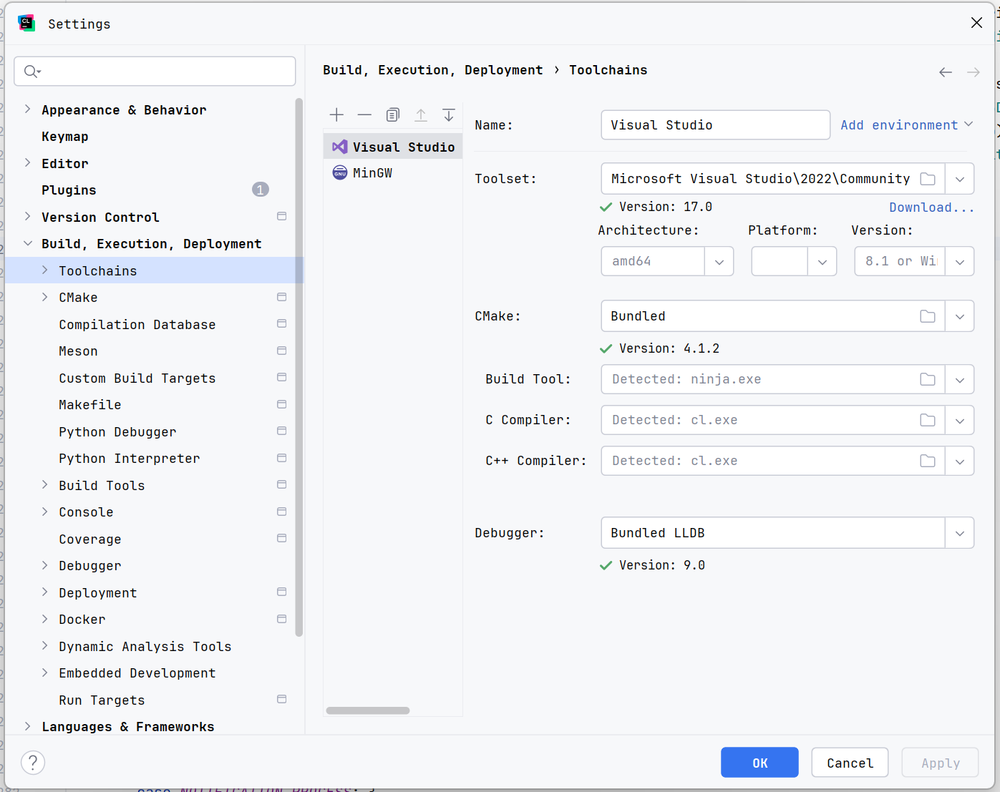


8. Redémarrez l'IDE.


9. On vous proposera probablement de configurer le projet CMake. Le chemin du fichier dont vous aurez besoin d'entrer est situé ici: ```platform\android\java\nativeSrcsConfigs\CMakeLists.txt```


10. À la racine du projet, faites une première compilation avec la commande suivante: ```scons dev_build=yes```

## 3 - Création d'un build de développement

11. Dans les paramètres de CLion, veuillez vous diriger dans: \
```Preferences > Build, Execution, Deployment > Custom Build Targets```
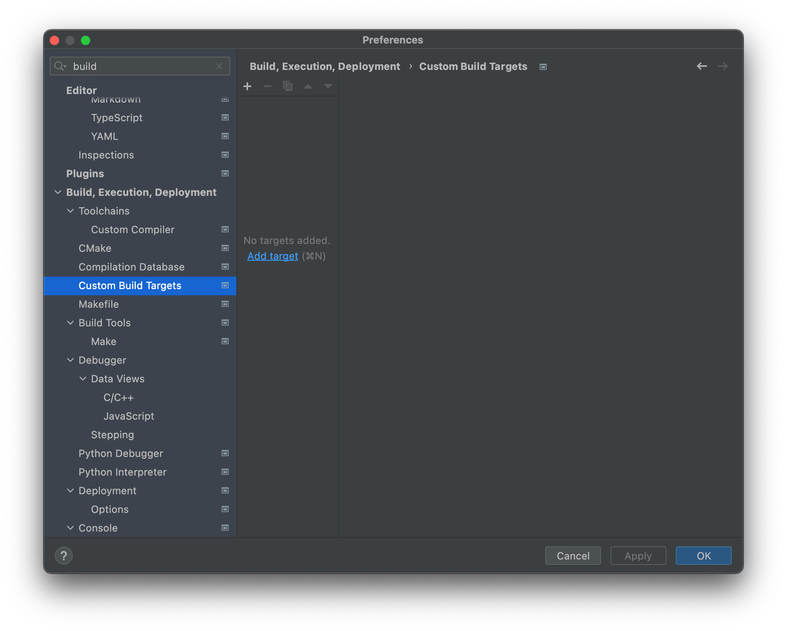

12. Ajoutez le «target», puis donnez-lui un nom pertinent, par exemple « Godot debug ».
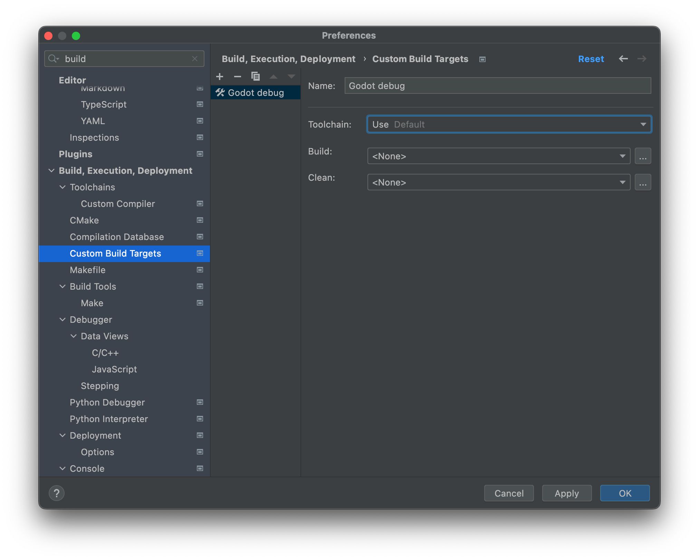

13. Cliquez sur les ... à la droite de la section « Build », puis cliquez le + dans les « External Tools ».
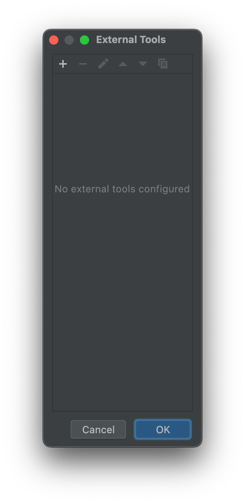

14. Nommez cet outil de façon pertinente, par exemple: « Build Godot debug », définir le programme comme étant SCons, et entrer l'argument ```dev_build=yes```. Le répertoire de travail sera assigné automatiquement avec ```$ProjectFileDir$```
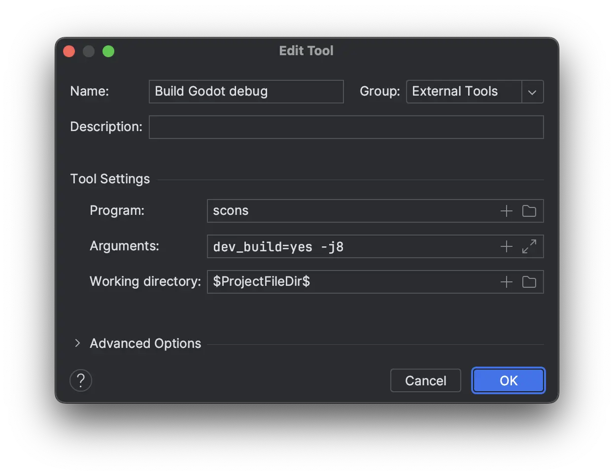

15. Veuillez faire un second outil, soit ```Clean Godot debug```, encore assigner SCons comme programme, puis entrer l'argument ```-c```. Le répertoire de travail sera encore assigné automatiquement avec ```$ProjectFileDir$```
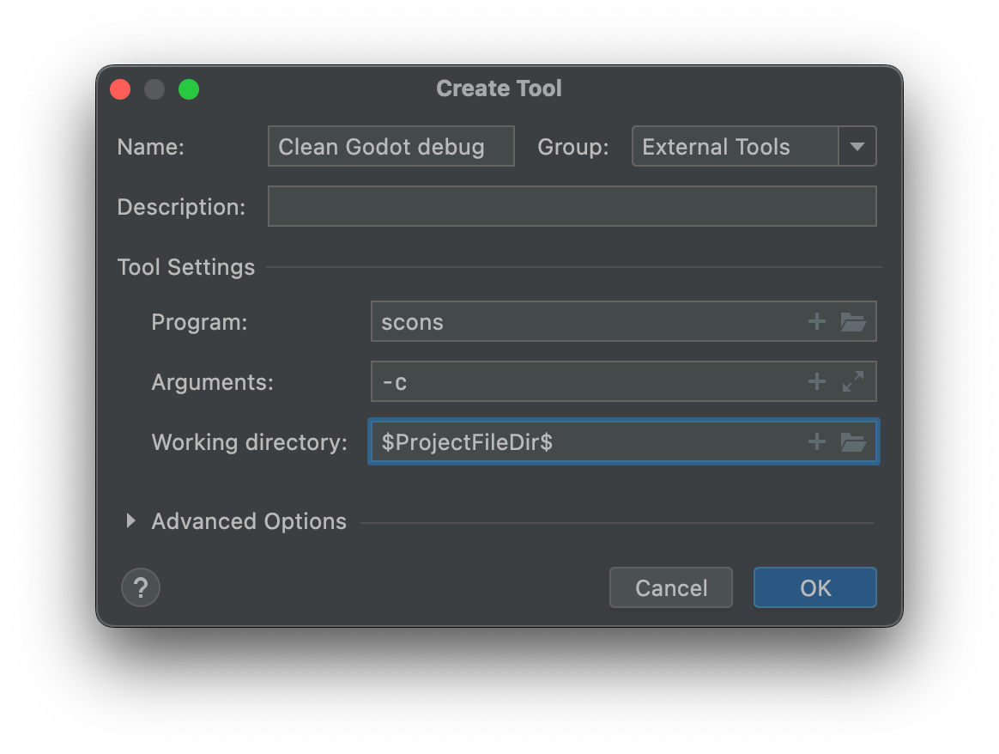

16. Vous pouvez maintenant fermer l'onglet pour les «External Tools», puis les utiliser pour votre configuration.
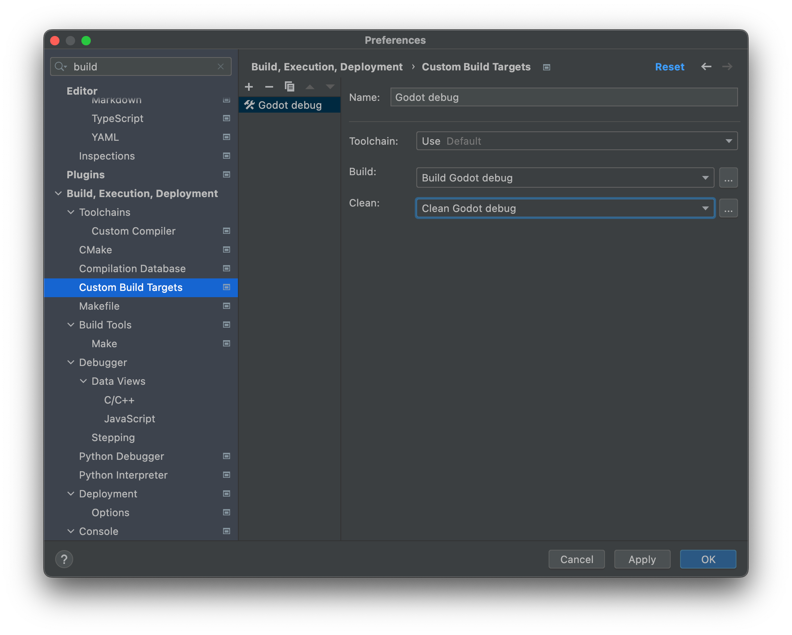


17. Cliquez sur «Apply» puis «OK», et ensuite fermez le menu des paramètres.

18. Dans la fenêtre principale de l'IDE, cliquez sur «Add configuration», puis ajoutez une configuration de type «Custom Build Application»\
\
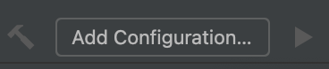
\
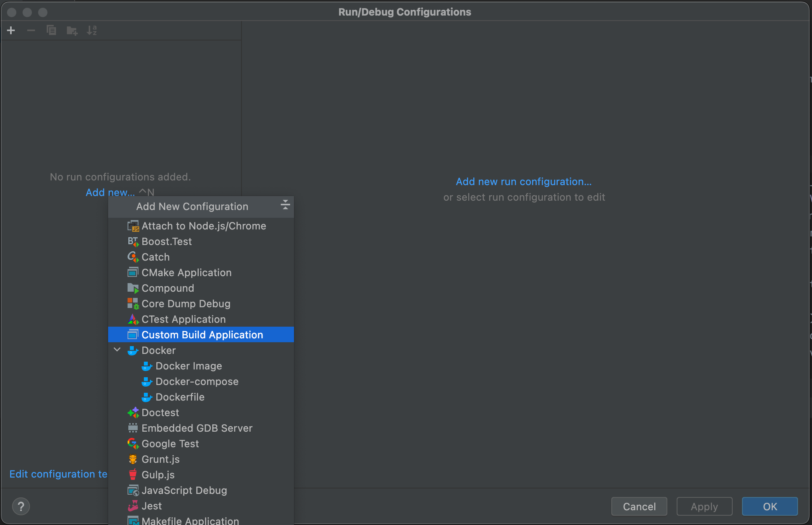

19. Nommez cette configuration ```Godot debug```, ou un autre nom significatif.\
L'exécutable est le fichier que vous avez compilé plus tôt.\
Il se trouve dans  ```/bin/godot.windows.editor.dev.x86_64.exe```\
\
Vous devez entrer en argument --editor, puis devrez également ajouter --path suivit du lien vers votre projet local, par exemple ```C:/projets/newProject1```. Si vous n'êtes pas certains, vous pouvez ouvrir votre autre installation officielle de Godot, puis vérifier où vous avez créé votre autre projet. Techniquement il n'est pas obligatoire d'ajouter le --path, mais vous serez bloqués dans le menu d'accueil de godot, puis si vous tentez d'accéder à un projet, le programme s'arrêtera.

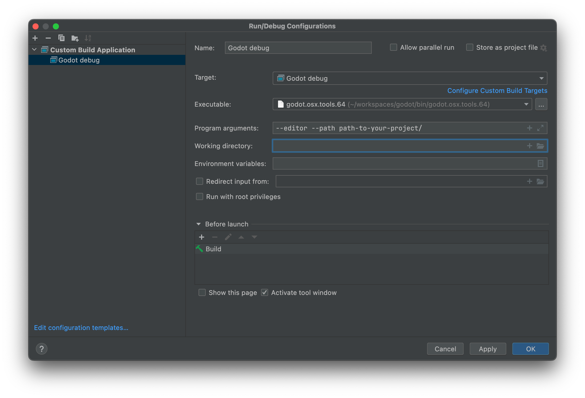

Vous pouvez maintenant lancer le projet!


# Instructions d'utilisation

Cliquer sur votre configuration pour démarrer le projet.

Alternativement, afin de tester un environnement tel ceux des versions stables, vous pouvez lancer le fichier exécutable généré dans /bin/.

Vous pouvez ajouter un Node3D afin de créer un environnement 3D.
Ensuite, vous pouvez ajouter des cubes avec CSGBox3D, des formes spéciales avec MeshInstance3D, ou encore une grille avec GridMap.

1. Vous pourrez constater que lorsque vous ajoutez un GridMap en Godot Engine version 4.6-stable, vous le verrez lors de la création, mais pas en naviguant dans les éléments dans l'arbre hiérarchique. En vous dirigeant sur la branche suivante, ce problème a été réglé:
```git checkout issue116469```


2. Certains appareils gèrent mal les calculs nécessaires pour dessiner le dessous de la grille, potenciellement avec les shaders et autre. Vous avez donc maintenant une option pour cacher seulement la grille sous l'axe y d'origine afin d'éviter d'y ressentir un lag énorme si votre appareil est touché.
Cette fonctionnalité est située sur la branche suivante:
```git checkout issue116151```
\
\
Dans votre éditeur, vous pourrez trouver l'option View Grid Bottom sous l'option View:
\
\
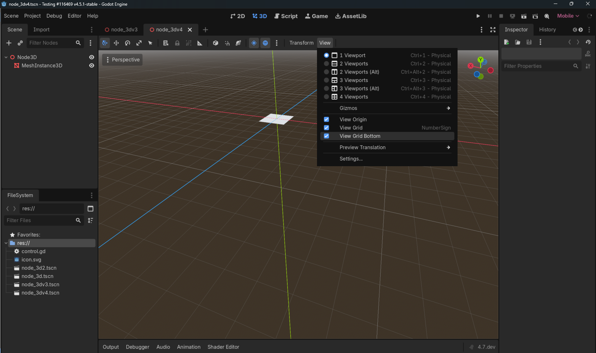
\
La désactiver cachera la grille lorsque la caméra sera située sous le y d'origine, tout en conservant la grille par dessus.


# Description des issues

## Issue #1: GridMap n'apparait pas

Lien vers la pull request:
https://github.com/godotengine/godot/pull/116810

Cet issue décrit principalement un problème où, lorsqu'on accède à une autre objet dans l'arbre hiérarchique des éléments de la scène, puis qu'on revient ensuite sur l'élément nommé GridMap, cette grille ne s'affiche plus, à moins qu'on change de scène et qu'on revienne, ou encore qu'on ajoute un autre GridMap puis qu'on navigue entre ces deux éléments.

De mon côté, j'ai été en mesure de reproduire le bug, puis ai énoncé mon intérêt pour prendre en charge ce ticket.

Par la suite, je suis plongé dans le code de Godot pour la première fois, de même pour le C++, puis la présence de fichiers headers pour chaque fichier cpp pour la définition de variables.

À ce moment là, j'avais encore des problèmes d'installation de mon environnement, alors je ne pouvais pas voir qui utilisait quelle classe. Je naviguait essentiellement avec le raccourci ```shift shift```, ou encore avec ```ctrl+f```.

J'ai tout de suite repéré ```grid_map_editor_plugin.cpp``` ainsi que ```grid_map_editor_plugin.h```, qui sont les deux fichiers utilisés pour dessiner cette grille. 

Après un petit moment de recherche, j'ai identifié certaines fonction intéressantes:

```edit()```: Change la grille. Est également le morceau principal qui appelle les deux fonction suivantes.

```_draw_grid()```: Redessine la grille

```update()```: Affiche la grille

```_notification(int p_what)```: Fait la gestion complète de toutes les interactions avec le «GridMap».

Ce qui a plus particulièrement attiré mon attention, c'est les options sur lesquelles ```_notification(int p_what)``` fait un switch-case:

- ```NOTIFICATION_ENTER_TREE```: Notification lancée lorsque le nœud est instancié et au changement de la scène.

- ```NOTIFICATION_EXIT_TREE```: Notification lancée lorsque le nœud est supprimé.

J'ai donc décidé d'ajouter une ligne pour tester si l'affichage serait réglé en l'affichant dès la sélection du nœud:

```
_draw_grids(node);
update_grid();
```
Cependant, node n'était potentiellement pas défini, alors je l'ai enrobé dans un if(node){...}
Cela a rétabli le comportement attendu du «GridMap», s'affichant à nouveau lors de sa sélection dans l'arbre hiérarchique à la gauche. 

J'ai ensuite créé la pull request, puis il y a quelques jours, on m'a plutôt suggéré que le problème pourrait plutôt être situé dans la gestion du GridMap lorsqu'on change de noeuds dans l'arbre hiérarchique, qu'il les effacerait intégralement plutôt que de les cacher. On a également critiqué le fait que cette portion de code était ainsi appelée en doublon puisqu'elle était déjà appelé par la fonction ```::edit()```, ce avec quoi je suis tout à fait d'accord, mais n'ai pas encore fait de retour sur cet issue puisque mon attention était portée à m'en trouver un second afin d'avoir du contenu à présenter.

J'ai également perdu une bonne quantité de temps à tenter de déterminer pourquoi ce bug n'était pas reproductible dans la version 4.5-stable.
J'ai navigué dans les logiques d'appels de plugins, puis inverser l'ordre d'appel semblait régler le tout, mais puisque ce module était une partie essentielle du moteur, je n'ai pas osé lui apporter des modifications afin d'éviter d'engendrer des problèmes dans d'autres modules puis détruire les optimisations qui ont été introduite précédemment. 

J'ai également appris à ce moment-là que dans Godot spécifiquement, il est possible d'utiliser la fonction print_line() afin d'afficher du contenu dans la console. 

J'ai aussi fini par arranger mon environnement de développement avec de l'aide d'autres personnes sur le site de contribution afin que je puisse naviguer en cliquant sur les appels de fonctions. 

J'ai eu de la difficulté à regrouper mes commits en 1 seul, et ainsi j'ai accidentellement fermé la pull request. Heureusement, j'ai réussi à la refaire correctement.

## Issue #2: Grid cause des bugs intense lorsque la caméra est sous le y d'origine
Lien vers la pull request:
https://github.com/godotengine/godot/pull/117002

Me semblant tout de même similaire à mon issue précédent, j'ai déterminé que cet issue serait intéressant puisque j'ai déjà navigué dans cette section du moteur de jeu.

J'ai commencé par suivre les étapes énoncées par l'auteur de l'issue afin de reproduire les bugs.\
Ce lag est spécifique aux appareils dotés d'une carte graphique Intel Iris XE.

J'ai pu reproduire le bug, et ce jusqu'à ce que je recule à la version 4.5.1-stable.\
Il s'agit donc d'une régression, puis j'ai suivit les opérations recommandées dans le guide de contribution officiel de Godot, en utilisant git bisect afin de déterminer le commit qui a introduit le problème.

```git bisect``` permet de prendre une version à mi-chemin entre un commit «bon», soit où le bug n'est pas présent, puis un commit «mauvais» où le bug est présent. Ce processus contient beaucoup d'itérations, puis rétrécie d'étape en étape la zone des commits parmi lesquels a pu être introduit l'erreur.

Je devais essentiellement faire:

1. ```git bisect start``` afin de démarrer la procédure.

2. ```git bisect bad 4.6-stable``` afin de signaler le commit erroné

3. ```git bisect good 4.5``` afin de signaler le commit le plus récent où l'erreur a été observée.

J'ai utilisé la procédure complète décrite ici: 

https://contributing.godotengine.org/en/latest/feedback/bisecting.html#

Par la suite, j'ai déterminé que l'origine du problème remontait à ce pull-request: 
https://github.com/godotengine/godot/pull/113213

Celui-ci a ajouté l'imposition du système de rendement Direct3D 12, ou DirectX 12.
Cependant, puis ce n'est pas limité à cet issue, mais cette insertion semble causer des problèmes sur divers appareils, ceux avec la carte graphique Intel Iris XE n'étant qu'un cas parmis tant d'autres. Les calculs nécessaires pour déterminer l'affichage des lignes seraient mal gérés par ces appareils.

Je n'ai pas réussi à régler ce problème, cependant j'ai développé une option permettant d'éviter le lag lié à celui-ci en cachant tout simplement la grille par défaut lorsque cette option est activée puis la caméra est située sous la hauteur du point d'origine.

Je l'ai également situé dans le menu qui semblait être le plus pertinent, où se trouve une option pour cacher la grille intégralement peu importe les circonstances.

J'ai justement identifié la section qui était responsable d'afficher cette grille, puis l'ai entourée d'un if() déterminant si la caméra était sous y=0, et si mon option était cochée. J'ai également inclu une vérification qui demande à redessiner cette grille si le symbole d'«y» change, afin de contourner l'actualisation aux 100 points si la caméra est trop basse ou vice-versa.

Par la suite, j'ai testé l'autre option qui cache toute la grille, puis si je la réactivait lorsque l'option de d'afficher le dessous de la grille était désactivé, la grille s'affichait. J'ai donc également dû modifier ce segment dans un autre commit.

J'ai encore eu des problèmes à regrouper mes commits en un seul, mais j'y suis parvenu. J'ai accidentellement merge sur la mauvaise branche et ai dû démêler le tout.

On a ensuite fermé ma merge request car le problème aurait été réglé différement depuis.

J'ai tenté de faire des tests unitaires pour cette pull request, cependant l'environnement de tests n'englobe pas l'éditeur, seulement certains de ses modules.
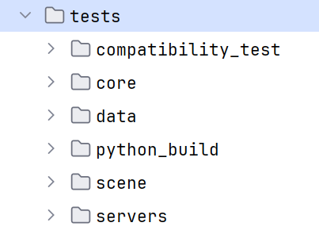
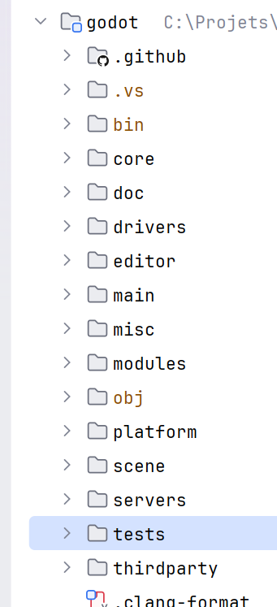

## Issue #3:  Dans l’éditeur de script, l'info-bulle affiché au survol de la souris ne reste pas fermé

Lien vers l'issue: https://github.com/godotengine/godot/issues/119213

Le problème décrit ici est que lorsqu'un infobulle de fonction est survolé dans un fichier de script de godot puis qu'on appuie sur la touche «Échaper» du clavier, l'info-bulle ne se retire qu'une fraction de seconde, puis réapparait immédiatement plutôt que de rester fermer.

Comme pour les autres issues, j'ai commencé par chercher où serait géré la logique des info-bulles, puis je suis tombé sur script_text_editor.cpp, qui gère essentiellement l'entrée de texte dans l'éditeur de code Godot. L'idée était que si ce module gérait l'entrée de touches, il devait potentiellement détecter la touche «échaper».

À la ligne 41 de popup.cpp, un commentaire semble indiquer que c'est l'endroit où on gère la touche «échaper», ou «escape» en anglais:
```
void Popup::_input_from_window(const Ref<InputEvent> &p_event) {
	if (get_flag(FLAG_POPUP) && p_event->is_action_pressed(SNAME("ui_cancel"), false, true)) {
		hide_reason = HIDE_REASON_CANCELED; // ESC pressed, mark as canceled unconditionally.
		_close_pressed();
	}
	Window::_input_from_window(p_event);
}
```

Sachant qu'on appelle la fonction dans «Window::», ce segment semble donc intercepter l'appel de cette fonction, puis ensuite exécuter son comportement normal.

J'ai donc tenté de répliquer la même chose.

Finalement, c'est dans ```CodeEdit::_on_symbol_tooltip_timer_timeout()``` qu'on renvoie l'événement de survol d'un élément. \
Le timeout devrait plutôt être arrêté quand on appuie sur la touche «échaper».

## Issue #4: Les info-bulles s'affiche pour du code situé derrière l'auto-complétion

Lien vers l'issue: https://github.com/godotengine/godot/issues/119215

J'ai prit la décision de l'intégrer à ma «pull request» de l'issue #3.

Cet issue semblait être assez similaire à celle que je venais de faire, alors j'ai cherché certains mots-clés de complétion de code avec ```CTRL+F```, puis j'ai simplement fait une fonction pour vérifier si la souris survole l'info-bulle. Je l'ai ensuite intégré dans la fonction qui détermine s'il est nécessaire d'envoyer le signal d'affichage de l'info-bulle.

# Tests

Exécuter la commande de compilation avec le paramètre de tests activé.
```
scons tests=yes
```

Ensuite, pour exécuter les tests, la commande pour windows est:
```
./bin/godot.windows.editor.x86_64.exe --test
```
Pour les autres plateformes:
```
./bin/<godot_binary> --test
```
Où ```<godot_binary>``` est remplacé par la version compilée correspondante.


# Annexes

## Comment ajouter python au PATH

Vous devez [ ... ]